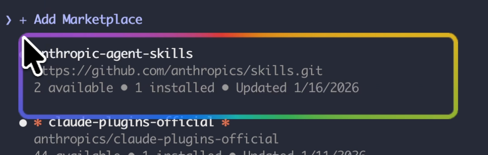

# 🎨 屏幕选框高亮工具

专为教师设计的 Mac 屏幕标注工具，可在任意位置画出炫彩彩虹边框，吸引学生注意力。

## ✨ 功能特点

- 🌈 **彩虹跑马灯边框** - 动态流动的彩虹色边框
- 🖱️ **鼠标拖拽画框** - 简单直观的操作方式
- ⏱️ **自动淡出消失** - 可配置消失时间
- ⌨️ **快捷键切换** - 快速进入/退出绘制模式
- 📍 **菜单栏常驻** - 不占用 Dock 空间
- 🚨 **紧急退出保护** - 确保程序可随时退出



---

## 🚀 安装方法

### 方式一：DMG 安装包（推荐）

1. [通过 release 下载 dmg 包](https://github.com/miclaoshi/screen-highlighter/releases)
2. 将应用拖拽到 Applications 文件夹
3. Command + ` 快捷键切换画图

### 方式二：开发模式

```bash
cd screen-highlighter
npm install
npm start
```

---

## 📖 使用方法

### 快捷键

| 快捷键 | 功能 |
|-------|------|
| **⌘+`** | 开启/关闭绘制模式（可自定义） |
| **Esc** | 退出绘制模式 |
| **⌘+⇧+Q** | 🚨 紧急退出程序 |

### 基本操作

1. 按 **⌘+`** 进入绘制模式
2. **拖拽鼠标** 画出矩形框（全程彩虹流动效果）
3. 松开鼠标后边框自动淡出消失
4. 再按 **⌘+`** 退出绘制模式

### 菜单栏操作

点击菜单栏图标可以：
- 🎨 开始绘制 / ⏸️ 暂停绘制
- ⚙️ 设置淡出时间和快捷键
- 🚪 退出程序

---

## ⚙️ 配置选项

### 淡出时间
可选：0.5秒 / 0.8秒 / 1.0秒 / 1.5秒 / 2.0秒

### 快捷键
可选：⌘+` / ⌘+D / ⌘+E / ⌘+⇧+H

配置保存在 `config.json`：
```json
{
    "shortcut": "CommandOrControl+`",
    "fadeOutDuration": 1.5
}
```

---

## 🚨 遇到问题？

### 鼠标被卡住
按 **⌘+⇧+Q** 紧急退出程序

### 程序无响应
1. 按 **Esc** 尝试退出绘制模式
2. 按 **⌘+⇧+Q** 强制退出
3. 使用活动监视器强制退出

---

## 📁 项目结构

```
screen-highlighter/
├── main.js         # Electron 主进程
├── preload.js      # 预加载脚本
├── renderer.js     # 渲染进程逻辑
├── index.html      # 页面结构
├── styles.css      # 样式文件
├── config.json     # 配置文件
├── package.json    # 项目配置
└── dist/           # 打包输出
    ├── 屏幕选框高亮-1.0.0-arm64.dmg   # 安装包
    └── mac-arm64/                      # 应用程序
```

---

## 🔧 开发

### 安装依赖
```bash
npm install
```

### 开发运行
```bash
npm start
```

### 打包应用
```bash
npm run build
```

---

## 📝 许可证

MIT License
